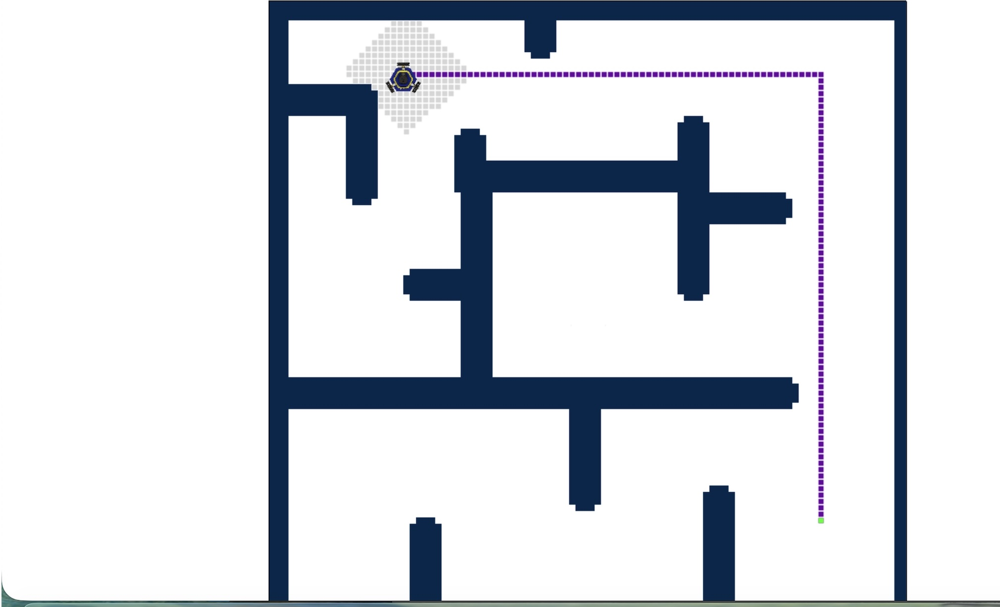
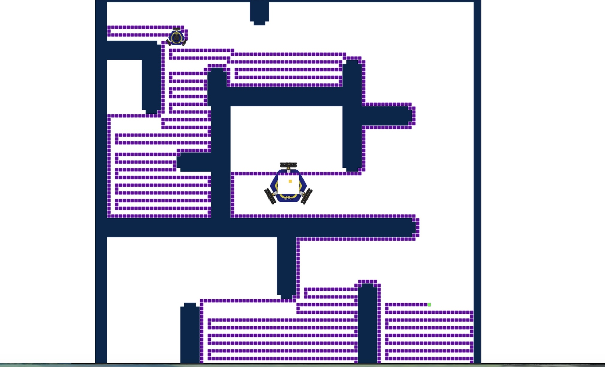

# Project 3: Path Planning (F23)


## BFS Result


## DFS Result


Reference code for [Project 3 (Graph Search)](https://hellorob.org/projects/p3).

This repository includes a server executable for visualization, which is
compatible with the [navigation web app](https://hellorob.org/nav-app/).

## Robot Usage

To compile, on the robot, do:
```bash
cd build
cmake -D MBOT=On ..
make
```

To run, do:
```bash
./robot_plan_path ~/current.map [goal_x] [goal_y]
```
